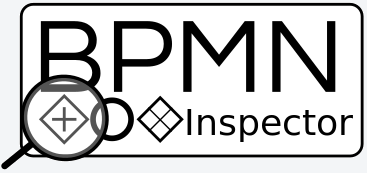

# BPMN Inspector

  
    
  
  

BPMN Inspector is a Java tool for statistical and qualitative analysis of a BPMN model collection. BPMN Inspector comes in the form of a web application that provides a user interface for inspecting several features of a model's collection.

## Table of contents
<!--ts-->
   * [Functionalities](#functionalities)
   * [Quickstart](#quickstart)
   * [How to run](#how-to-run)
   * [Technical Information](#technical-information)
<!--te-->

## Functionalities

## Quickstart

The web application is available and ready to use at the following link:
**[BPMN Inspector](https://pros.unicam.it/bpmn-inspector/)**.

A tutorial on its usage is available by clicking the image below:
TODO

The user can perform very simple steps to analyze a collection of BPMN models:
- In the *HOME* page, the user can load one or more BPMN models file  from local storage with the corresponding button or one of the sample images by clicking on them;

# Technical Information

BPMN Inspector was developed using [Hilla](https://hilla.dev/), an open source framework that integrates a Spring Boot Java backend with a reactive TypeScript frontend, which in this tool is React.

## Technical Requirements

- [Node](https://nodejs.org/en) 16.14 or later;
- [JDK](https://www.oracle.com/be/java/technologies/downloads/#java17) 17 or later.
